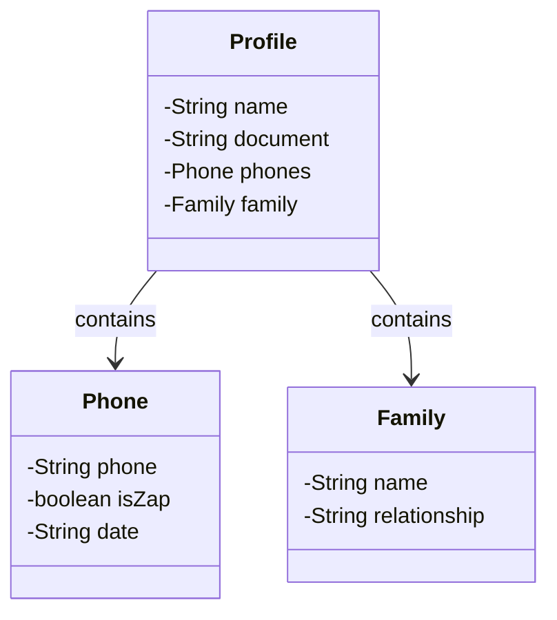

# Projeto API DIO com Railway 
Java RESTful API

## Diagrama de Classes

```mermaid
  classDiagram
    class Profile {
        -String name
        -String document
        -Phone phones
        -Family family
    }
    class Phone {
        -String phone
        -boolean isZap
        -String date
    }
    class Family {
        -String name
        -String relationship
    }

    Profile --> Phone : contains
    Profile --> Family : contains
```
